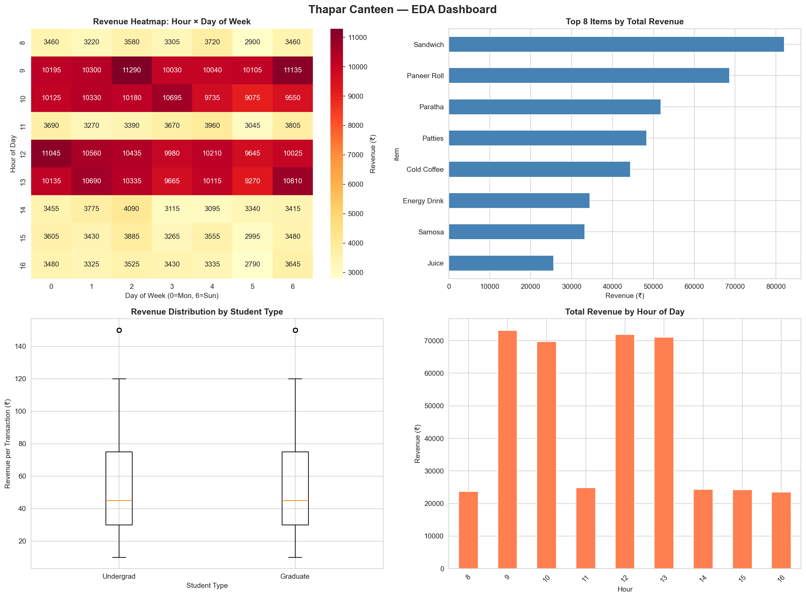
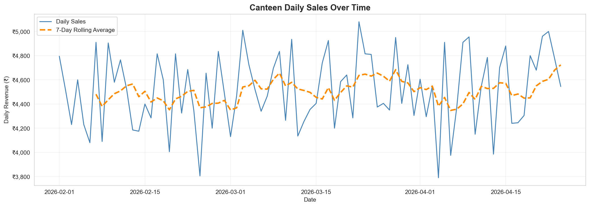
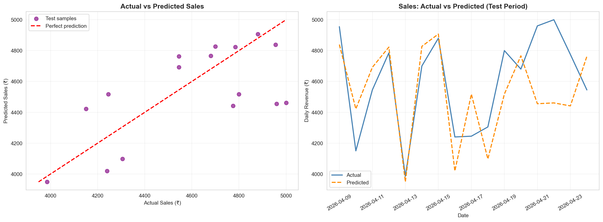
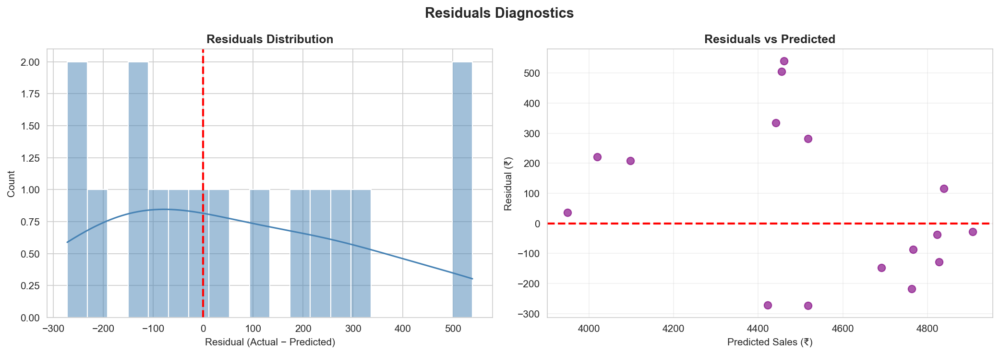
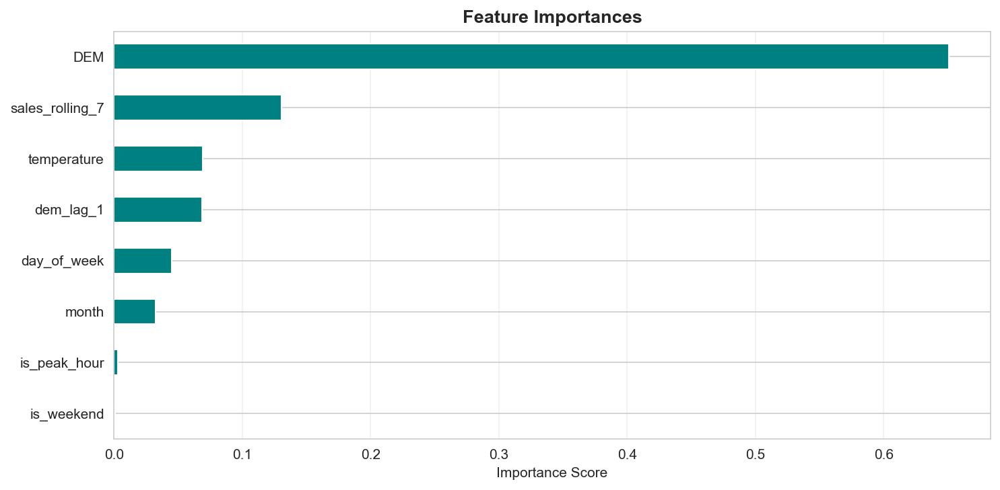

# Visualizations

This file shows all generated charts for the Thapar Canteen Sales Optimizer pipeline.

## 1) EDA Dashboard

## 2) Sales Over Time

## 3) Actual vs Predicted

## 4) Residual Diagnostics

## 5) Feature Importances

